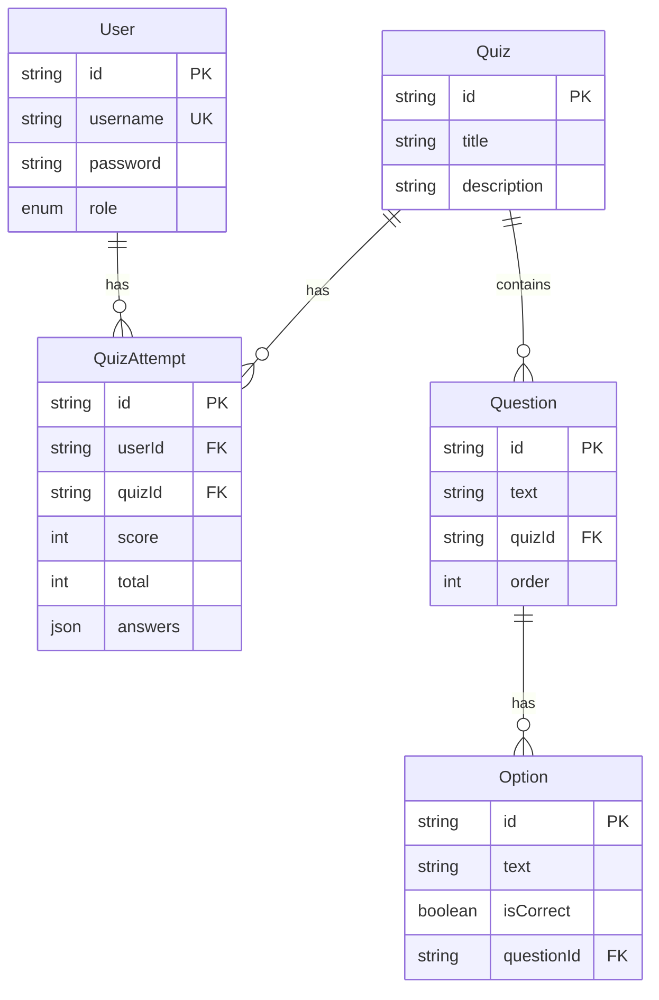

# Design Document - Online Quiz System

## Overview

سیستم آزمون آنلاین یک اپلیکیشن Next.js است که با استفاده از قالب Minimal MUI ساخته می‌شود. این سیستم شامل احراز هویت JWT، مدیریت آزمون‌ها، شرکت در آزمون و نمایش نتایج است. از Prisma به عنوان ORM و PostgreSQL به عنوان دیتابیس استفاده می‌شود.

### Tech Stack
- **Frontend**: Next.js 15 + React 19 + MUI 7
- **Backend**: Next.js API Routes
- **ORM**: Prisma
- **Database**: PostgreSQL
- **Authentication**: JWT (bcrypt برای هش پسورد)
- **Charts**: ApexCharts (موجود در قالب)

## Architecture

```mermaid
graph TB
    subgraph Frontend
        A[Pages/Components] --> B[Auth Context]
        A --> C[API Hooks]
    end
    
    subgraph API Routes
        D[/api/auth/*] --> E[Auth Service]
        F[/api/quizzes/*] --> G[Quiz Service]
        H[/api/attempts/*] --> I[Attempt Service]
    end
    
    subgraph Database
        J[(PostgreSQL)]
    end
    
    C --> D
    C --> F
    C --> H
    E --> K[Prisma Client]
    G --> K
    I --> K
    K --> J
```

### Directory Structure
```
src/
├── app/
│   ├── api/
│   │   ├── auth/
│   │   │   ├── register/route.js
│   │   │   ├── login/route.js
│   │   │   └── me/route.js
│   │   ├── quizzes/
│   │   │   ├── route.js (GET all, POST create)
│   │   │   └── [id]/route.js (GET single)
│   │   └── attempts/
│   │       └── route.js (POST submit, GET history)
│   ├── auth/jwt/
│   │   ├── sign-in/
│   │   └── sign-up/
│   └── dashboard/
│       ├── page.jsx (quiz list)
│       ├── quiz/[id]/page.jsx (take quiz)
│       ├── results/[attemptId]/page.jsx (results)
│       └── admin/
│           └── create-quiz/page.jsx
├── lib/
│   └── prisma.js
└── prisma/
    ├── schema.prisma
    └── seed.js
```

## Components and Interfaces

### API Endpoints

#### Authentication
| Endpoint | Method | Description | Auth Required |
|----------|--------|-------------|---------------|
| `/api/auth/register` | POST | ثبت‌نام کاربر جدید | No |
| `/api/auth/login` | POST | ورود و دریافت JWT | No |
| `/api/auth/me` | GET | دریافت اطلاعات کاربر فعلی | Yes |

#### Quizzes
| Endpoint | Method | Description | Auth Required |
|----------|--------|-------------|---------------|
| `/api/quizzes` | GET | لیست همه آزمون‌ها | Yes |
| `/api/quizzes` | POST | ایجاد آزمون جدید | Admin |
| `/api/quizzes/[id]` | GET | دریافت آزمون با سوالات | Yes |

#### Attempts
| Endpoint | Method | Description | Auth Required |
|----------|--------|-------------|---------------|
| `/api/attempts` | POST | ثبت نتیجه آزمون | Yes |
| `/api/attempts` | GET | تاریخچه آزمون‌های کاربر | Yes |
| `/api/attempts/[id]` | GET | جزئیات یک attempt | Yes |

### Request/Response Interfaces

```typescript
// Register Request
interface RegisterRequest {
  username: string;
  password: string;
}

// Login Request
interface LoginRequest {
  username: string;
  password: string;
}

// Login Response
interface LoginResponse {
  token: string;
  user: {
    id: string;
    username: string;
    role: 'user' | 'admin';
  };
}

// Quiz List Response
interface QuizListItem {
  id: string;
  title: string;
  description: string;
  questionCount: number;
  userScore?: number; // if user has attempted
}

// Quiz Detail Response
interface QuizDetail {
  id: string;
  title: string;
  description: string;
  questions: {
    id: string;
    text: string;
    options: {
      id: string;
      text: string;
    }[];
  }[];
}

// Submit Attempt Request
interface SubmitAttemptRequest {
  quizId: string;
  answers: {
    questionId: string;
    optionId: string;
  }[];
}

// Attempt Result Response
interface AttemptResult {
  id: string;
  score: number;
  totalQuestions: number;
  correctCount: number;
  incorrectCount: number;
  percentage: number;
  createdAt: string;
}
```

## Data Models

### Prisma Schema

```prisma
model User {
  id        String   @id @default(cuid())
  username  String   @unique
  password  String
  role      Role     @default(USER)
  attempts  QuizAttempt[]
  createdAt DateTime @default(now())
  updatedAt DateTime @updatedAt
}

enum Role {
  USER
  ADMIN
}

model Quiz {
  id          String   @id @default(cuid())
  title       String
  description String
  questions   Question[]
  attempts    QuizAttempt[]
  createdAt   DateTime @default(now())
  updatedAt   DateTime @updatedAt
}

model Question {
  id        String   @id @default(cuid())
  text      String
  quiz      Quiz     @relation(fields: [quizId], references: [id], onDelete: Cascade)
  quizId    String
  options   Option[]
  order     Int
}

model Option {
  id         String   @id @default(cuid())
  text       String
  isCorrect  Boolean  @default(false)
  question   Question @relation(fields: [questionId], references: [id], onDelete: Cascade)
  questionId String
}

model QuizAttempt {
  id        String   @id @default(cuid())
  user      User     @relation(fields: [userId], references: [id])
  userId    String
  quiz      Quiz     @relation(fields: [quizId], references: [id])
  quizId    String
  score     Int
  total     Int
  answers   Json     // Array of {questionId, optionId, isCorrect}
  createdAt DateTime @default(now())
}
```

### Entity Relationships



## Correctness Properties

*A property is a characteristic or behavior that should hold true across all valid executions of a system-essentially, a formal statement about what the system should do. Properties serve as the bridge between human-readable specifications and machine-verifiable correctness guarantees.*

### Property 1: Registration creates user with correct default role
*For any* valid registration request with non-empty username and password, the created user SHALL have role "USER" and the password SHALL be stored as a hash (not plaintext).
**Validates: Requirements 1.1, 1.4**

### Property 2: Empty credentials rejection
*For any* registration or login request with empty or whitespace-only username or password, the system SHALL reject the request with a validation error.
**Validates: Requirements 1.3, 2.2**

### Property 3: Authentication round-trip
*For any* registered user, logging in with correct credentials SHALL return a valid JWT token that can be used to retrieve the same user's information via the /me endpoint.
**Validates: Requirements 2.1, 2.3**

### Property 4: Invalid credentials rejection
*For any* login attempt with non-existent username or incorrect password, the system SHALL reject authentication.
**Validates: Requirements 2.2**

### Property 5: Quiz list completeness
*For any* authenticated user accessing the dashboard, the response SHALL include all quizzes with accurate question counts.
**Validates: Requirements 3.1, 3.2**

### Property 6: Quiz data integrity
*For any* quiz in the system, each question SHALL have exactly 4 options and exactly one option marked as correct.
**Validates: Requirements 4.1, 6.2, 7.2, 7.3**

### Property 7: Score calculation correctness
*For any* quiz submission, the calculated score SHALL equal the count of answers where the selected option matches the correct option for that question.
**Validates: Requirements 5.1, 5.4**

### Property 8: Attempt persistence round-trip
*For any* completed quiz submission, the attempt record SHALL be stored in the database and retrievable with the same score and answer data.
**Validates: Requirements 5.3**

### Property 9: Admin access control
*For any* user with role "USER", attempting to access admin-only endpoints (quiz creation) SHALL result in access denial.
**Validates: Requirements 6.4**

## Error Handling

### API Error Responses
```javascript
// Standard error response format
{
  error: {
    code: string,      // e.g., "VALIDATION_ERROR", "UNAUTHORIZED"
    message: string,   // Human-readable message
  }
}

// HTTP Status Codes
// 400 - Bad Request (validation errors)
// 401 - Unauthorized (missing/invalid token)
// 403 - Forbidden (insufficient permissions)
// 404 - Not Found
// 500 - Internal Server Error
```

### Error Scenarios
| Scenario | Status | Code |
|----------|--------|------|
| Empty username/password | 400 | VALIDATION_ERROR |
| Duplicate username | 400 | USERNAME_EXISTS |
| Invalid credentials | 401 | INVALID_CREDENTIALS |
| Missing JWT token | 401 | UNAUTHORIZED |
| Non-admin accessing admin route | 403 | FORBIDDEN |
| Quiz not found | 404 | NOT_FOUND |

## Testing Strategy

### Testing Framework
- **Unit Tests**: Vitest
- **Property-Based Testing**: fast-check

### Unit Tests
- API route handlers
- Score calculation logic
- JWT token generation/validation
- Password hashing/verification

### Property-Based Tests
هر property-based test باید با کامنت زیر مشخص شود:
`// **Feature: online-quiz, Property {number}: {property_text}**`

تست‌ها باید حداقل 100 iteration اجرا شوند.

#### Test Categories
1. **Authentication Properties**: Registration, login, token validation
2. **Data Integrity Properties**: Quiz structure, option counts
3. **Business Logic Properties**: Score calculation, access control
4. **Persistence Properties**: Round-trip storage and retrieval
